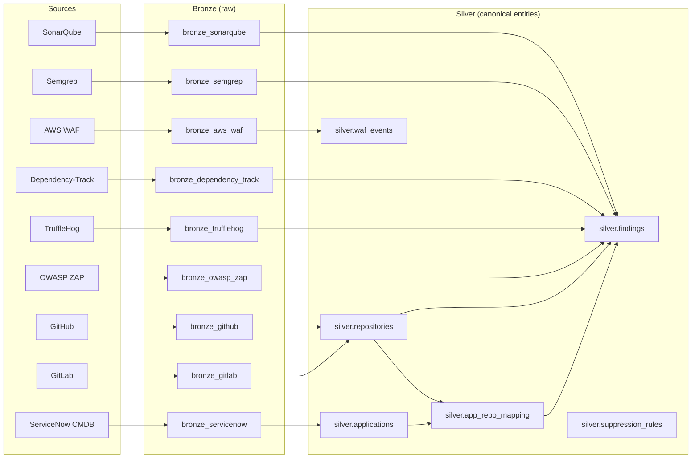
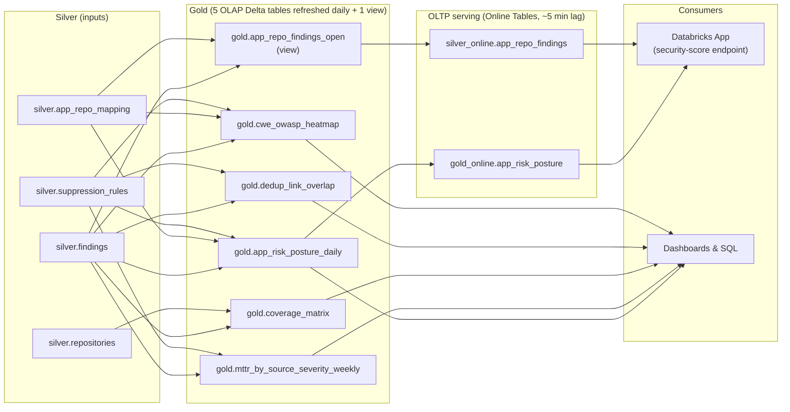

# appsec-mvp

> **A reference implementation of a data integration framework for application security, built on Databricks.**

The platform ingests AppSec findings from heterogeneous sources (CMDB, SCM, SAST, SCA, Secrets, DAST, WAF), normalizes them to a standard Bronze, Silver, Gold lakehouse, and exposes evidence for analytics and compliance reviews. Python connectors run on Databricks (Unity Catalog) and are packaged as a Databricks Asset Bundle (DAB).

This repository stores the MVP implementation part of my master's thesis. The companion docs site at <https://vkraus.github.io/appsec-mvp/> is the product documentation and the implementation guide; this README is the engineer-facing entry point.

---

## Table of contents

- [Overview](#overview)
- [Architecture](#architecture)
- [Quickstart](#quickstart)
- [Repository layout](#repository-layout)
- [Connector inventory](#connector-inventory)
- [Connector module structure](#connector-module-structure)
- [Architectural rules](#architectural-rules)
- [Development](#development)
- [Documentation](#documentation)
- [Project status](#project-status)
- [Contributing](#contributing)

---

## Overview

**What it does.** Pulls findings, asset data, and CMDB records from up to nine AppSec sources into a Databricks lakehouse, normalizes severity, status, and dedup tuples per a published mapping contract, and exposes joinable Silver entities (`silver.findings`, `silver.repositories`, `silver.applications`, `silver.app_repo_mapping`, `silver.suppression_rules`, `silver.waf_events`, `silver.hwm`, `silver.finding_location`) plus per-connector projections (`silver_<source>.*`), five materialized Gold OLAP tables refreshed daily, a Gold view backing two OLTP Online Tables, and a Databricks App that serves a sub-50 ms security-score endpoint over the latter.

**Why it exists.** Production AppSec stacks are a tangle of point integrations between scanner SaaS, CMDB, ticketing, and analytics. Each one comes with its own auth model, pagination contract, and severity vocabulary. This MVP is a thesis-grade reference for *how to ingest those tools systematically*. It provides a single framework primitive (HTTP client, paginator, HWM state, recommended normalization), a fixed connector contract (`ingest()`, `transform()`, `mapping.yml`, `config.yml`, `severity.yml`, `status.yml`), and a fixed deployment unit (DAB). Adding a tenth source is a fill-in-the-blanks exercise, not an integration project.

**Where it runs.** Databricks (any workspace with a Unity Catalog metastore). Local Python is for unit tests only. Spark sessions never run on a developer workstation. Supporting infrastructure (the source systems themselves: SonarQube server, Semgrep CronJob, ZAP daemon, GitHub seed repos, ServiceNow CMDB seeds) is deployed via Terraform or k8s modules for each connector at `src/connectors/<source>/runtime/`. Each module is **optional** and self-contained. Users with their own SonarQube, GitHub, ZAP, etc. skip it and feed URLs and tokens directly.

**Who it's for.** The thesis reviewer (Requirements Specification + traceability matrix at <https://vkraus.github.io/appsec-mvp/>) and engineers building or extending AppSec data integration on Databricks.

---

## Architecture

The architecture splits into two stages — ingest (Sources → Bronze → Silver) and analytics & serving (Silver → Gold → OLTP → Consumers). Drawing them as separate flowcharts keeps each stage's text legible.

### Ingest

Every AppSec source has a per-source connector that lands raw data in a Bronze schema and projects normalized findings + entities into a canonical Silver layer.



### Analytics & serving

Five Gold tables aggregate Silver into daily snapshots; two Online Tables (~5 min lag) serve those plus an open-findings view to a Databricks App for sub-50 ms point lookups, while all Gold tables also feed dashboards.



**Layering principle (data-level dependency).** Within Phase 2 (connectors), an SCM connector (GitHub or GitLab) must be installed *first* because non-SCM connector findings reference `silver.repositories.repository_id` populated by SCM. This is an ordering at job-run time. Connector setup code remains independent. See [Architectural rules](#architectural-rules).

---

## Quickstart

The full user runbook lives in the [docs site](https://vkraus.github.io/appsec-mvp/). What follows is the condensed flow for engineers.

### Prerequisites

You bring:

| | What | Where used |
|---|---|---|
| 1 | **Databricks workspace** (any cloud) with a Unity Catalog metastore | every job and resource |
| 2 | A **SQL warehouse ID** | the platform-bootstrap job (silver-table DDL) |
| 3 | An **S3 bucket** for scanner artifacts | external location for Semgrep and ZAP findings |
| 4 | An **AWS IAM role ARN** for the UC external location | storage credential the bundle declares |
| 5 | URLs and tokens or credentials for each source | secrets the connectors read |

The full prerequisites breakdown is at <https://vkraus.github.io/appsec-mvp/platform/prerequisites/>. It includes the AWS backbone you bring (VPC, EKS, RDS, ECR, IAM for IRSA) if you also want this repo to stand up the source systems.

### Phase 1: Setup platform

```bash
# 1. Validate + deploy the bundle
databricks bundle validate
databricks bundle deploy --target dev

# 2. Run the post-deploy bootstrap (creates UC external location + secret scope)
export EXTERNAL_LOCATION_ROLE_ARN=arn:aws:iam::<acct>:role/<role>
export ARTIFACT_BUCKET=<your-s3-bucket>
export CATALOG=appsec_dev
bash src/platform/scripts/bootstrap.sh

# 3. Apply silver-table DDL (one-time, on-demand)
databricks bundle run platform-bootstrap
```

### Phase 2: Install connectors (any order; SCM first per layering rule)

For each connector:

```bash
# (Optional) provision the source-system itself if you want this repo to stand it up:
cd src/connectors/<source>/runtime && terraform init && terraform apply

# Populate the secrets for this connector into the mvp-connectors scope:
bash src/connectors/<source>/scripts/load-secrets.sh

# Trigger the connector job:
databricks bundle run <source>-connector
# (or for ServiceNow:)
databricks bundle run servicenow-ingest
```

### Phase 3: Build analytics

`src/analytics/` ships five Gold OLAP notebooks (`app_risk_posture_daily`, `mttr_by_source_severity_weekly`, `coverage_matrix`, `dedup_link_overlap`, `cwe_owasp_heatmap`) plus a Gold view (`app_repo_findings_open`), all driven by `analytics-job.yml` on a daily schedule, two Online Tables for OLTP serving (`gold_online.app_risk_posture`, `silver_online.app_repo_findings`), an operator-authored suppression-rules pipeline (`silver.suppression_rules` + `lib/suppression.py`), and a Databricks App (`src/analytics/app/`) that serves the security-score endpoint. See [Build analytics](https://vkraus.github.io/appsec-mvp/analytics/) on the docs site for per-dataset detail.

---

## Repository layout

```
appsec-mvp/
├── README.md                         this file
├── CLAUDE.md                         agent instructions (private and local, gitignored)
├── pyproject.toml                    Python deps, pytest config, wheel packaging
├── ruff.toml                         lint config
├── conftest.py                       global PYSPARK_* env setup
├── databricks.yml                    DAB bundle root: targets, variables, include glob
│
├── src/
│   ├── platform/                     framework plus cross-source silver layer
│   │   ├── http.py, pagination.py, hwm.py, contract.py, …  framework primitives
│   │   ├── silver.py                 severity and status normalization, dedup
│   │   ├── resources/
│   │   │   ├── platform.yml          catalog plus cross-source `silver` schema
│   │   │   └── bootstrap-job.yml     one-time silver_tables.sql job
│   │   ├── sql/
│   │   │   └── silver_tables.sql     silver.{findings, finding_location, hwm, repositories, applications, app_repo_mapping, waf_events, suppression_rules}
│   │   ├── scripts/
│   │   │   └── bootstrap.sh          post-deploy: scope, storage credential, external location
│   │   └── tests/                    framework tests
│   │
│   ├── connectors/                   one folder per source. See "Connector module structure" below.
│   │   ├── github/
│   │   ├── gitlab/
│   │   ├── servicenow/
│   │   ├── sonarqube/
│   │   ├── semgrep/
│   │   ├── owasp_zap/
│   │   ├── trufflehog/
│   │   ├── dependency_track/
│   │   └── aws_waf/
│   │
│   └── analytics/                    Gold layer + OLTP serving + Databricks App
│       ├── resources/{schemas,job,app,online_schemas,online_tables}.yml  DAB resources
│       ├── notebooks/gold/           5 Gold OLAP notebooks + 1 view
│       ├── notebooks/admin/          operator suppression-rules notebook
│       ├── lib/suppression.py        apply_suppression_rules helper
│       ├── app/                      Databricks App (security-score endpoint)
│       ├── tests/                    Gold + suppression unit tests
│       └── sql/                      gold-layer placeholder DDL
│
├── examples/
│   └── end-to-end-demo/              cross-scanner CI workflow recipe (Sonar, Semgrep, ZAP)
│                                     intentionally outside src/. It consumes URLs and tokens
│                                     from MULTIPLE connectors, violating the no-inter-connector
│                                     dependency rule by design.
│
├── mkdocs/                           docs site (published to vkraus.github.io/appsec-mvp/)
└── .claude/skills/                   skill specializations (analyze-source, provision-source,
                                      generate-connector, validate-implementation), used by the
                                      connector skill chain
```

---

## Connector inventory

Adoption order (SCM first per the layering rule):

| Category | Source | Status | Implementation | Optional source-system runtime |
|---|---|---|---|---|
| **SCM** | GitHub | ✅ implemented | `src/connectors/github/` | Terraform: seed repos, Juice Shop fork, ECR, GitHub Actions OIDC IAM |
| **SCM** | GitLab | ✅ skill-generated | `src/connectors/gitlab/` | (none; user brings GitLab tenant) |
| **CMDB** | ServiceNow | ✅ implemented | `src/connectors/servicenow/` (Lakeflow Connect pipeline) | Terraform: seeds CMDB business-app records via REST |
| **SAST** | SonarQube | ✅ skill-generated | `src/connectors/sonarqube/` | Terraform: Helm install plus RDS Postgres backing store |
| **SAST** | Semgrep | ✅ implemented | `src/connectors/semgrep/` (CLI artifact path; reads from S3) | Terraform: k8s CronJob plus IRSA role |
| **SCA** | Dependency-Track | ✅ skill-generated | `src/connectors/dependency_track/` | (none; user brings DT instance) |
| **Secrets** | TruffleHog | ✅ skill-generated | `src/connectors/trufflehog/` | (none; user runs TruffleHog in CI) |
| **DAST** | OWASP ZAP | ✅ implemented | `src/connectors/owasp_zap/` (artifact path plus scan-and-read) | Terraform: k8s daemon plus LoadBalancer |
| **WAF** | AWS WAF | ✅ skill-generated | `src/connectors/aws_waf/` | (none; AWS account WAF is the source) |

**Skill-generated** connectors were produced by the skill chain at `.claude/skills/` (`analyze-source`, then `provision-source`, then `generate-connector`, then `validate-implementation`). See [`mkdocs/docs/platform/reference/connector-skills.md`](mkdocs/docs/platform/reference/connector-skills.md) for the chain and Implementation logs for each connector.

---

## Connector module structure

Every connector at `src/connectors/<source>/` carries the same structure, so adding a tenth source is mechanical:

```
src/connectors/<source>/
├── __init__.py
├── ingest.py                     ingest(run_id, state) -> BatchDescriptor
├── transform.py                  transform(bronze_df) -> silver_df
├── mapping.yml                   bronze to silver column expressions
├── config.yml                    base URL, pagination, HWM column, secret refs
├── severity.yml                  native severity to standard severity lookup
├── status.yml                    native status to standard status lookup
├── ingest_entry.py               (optional) Databricks notebook entry for the ingest task
├── transform_entry.py            (optional) Databricks notebook entry for the transform task
│
├── resources/                    DAB resources for this connector
│   ├── schemas.yml               bronze_<source> (and silver_<source> if applicable)
│   ├── job.yml                   ingest then transform job declaration
│   ├── volumes.yml               (scanner connectors only) external volume for S3 artifacts
│   ├── connection.yml            (Lakeflow connectors only) UC connection
│   └── pipeline.yml              (Lakeflow connectors only) ingestion pipeline
│
├── scripts/
│   └── load-secrets.sh           populates the keys for this connector into the `mvp-connectors` scope
│
├── runtime/                      (optional) Terraform module for source-system bring-up
│   ├── versions.tf
│   ├── variables.tf              user-supplied inputs only; no cross-runtime references
│   ├── main.tf
│   ├── outputs.tf
│   ├── README.md
│   └── files/                    (optional) embedded artifacts (e.g. semgrep-scan.sh)
│
└── tests/                        co-located pytest suite
    ├── test_*.py
    └── fixtures/                 JSON fixtures for each endpoint
```

---

## Architectural rules

These are enforced by code review, not by the runtime. Violating them breaks either the layering rule, the deployment story, or the reproducibility claim of the thesis.

1. **No local Spark.** Pure Python logic (parsing, mapping, dedup, normalization) is unit-tested locally. Anything that touches `SparkSession` runs via Databricks Connect or a remote job. Never a `local[*]` session. `conftest.py` only aligns `PYSPARK_PYTHON` and `PYSPARK_DRIVER_PYTHON` in case Spark gets imported accidentally. It is not a license to write local Spark tests.

2. **Ingestion tooling preference order.** Lakeflow Connect, then Databricks SDK, then `dlt` (dltHub REST source). Pick the highest-level tool that covers the contract for the source. Raw `httpx` or `requests` is off-limits for new connectors unless none of the three apply. CLI artifact connectors (Semgrep Docker, TruffleHog) are the documented exception.

3. **Mapping, severity, and status are declarative.** Add fields to `mapping.yml` or `<connector>/{severity,status}.yml`. Do not move that logic into `transform.py`. Transforms are generic applicators driven by YAML.

4. **Requirement markers.** Framework contract tests carry `@pytest.mark.requirement("REQ-...")`. IDs match the REQ catalog at [`mkdocs/docs/platform/reference/catalog.md`](mkdocs/docs/platform/reference/catalog.md). This is how the traceability matrix is built.

5. **Layering rule.** Three install layers with no upward or sideways dependencies in setup code:
   - **Platform first, connectors next, analytics last.**
   - Within Phase 2, an SCM connector (GitHub or GitLab) must be **run** first because non-SCM connectors map findings to repository entities populated by SCM. This is a *data-level* dependency at job-run time only. Connector setup code remains fully independent.
   - The platform layer must not pre-declare resources for individual connectors (no schemas, volumes, connections, or secrets for any source in `src/platform/resources/`). Each connector declares its own under `src/connectors/<source>/resources/`.
   - No `module {}` blocks across connector runtimes. No shared scripts. No cross-connector references in YAML.

6. **DAB owns Databricks; no `databricks` Terraform provider.** Every Databricks resource (catalog, schemas, volumes, jobs, pipelines, ServiceNow Lakeflow connection) is declared in DAB YAMLs under `src/<component>/resources/`. The handful of Databricks objects DAB has no native type for (secret scope container, UC storage credential, UC external location) are created post-deploy by `src/platform/scripts/bootstrap.sh`. Secret values for each connector are loaded by `src/connectors/<source>/scripts/load-secrets.sh`.

7. **Don't.**
   - …write local Spark tests.
   - …add a fourth ingestion path when Lakeflow Connect, SDK, or dlt fits.
   - …move severity or status logic into Python.
   - …use the `databricks` Terraform provider.
   - …pre-declare resources for individual connectors at the platform layer.
   - …reference resources, secrets, or runtime outputs of one connector from the setup code of another connector. Cross-connector orchestration glue lives at `examples/end-to-end-demo/`.

---

## Development

### Tests

```bash
pytest                                                # full suite
pytest src/connectors/github/tests/test_transform.py  # one connector
pytest -m 'requirement("REQ-ING-HWM")'                # one REQ-ID
```

Tests are co-located under the `tests/` folder of each component. The `[tool.pytest.ini_options].testpaths` value in `pyproject.toml` is `src/`. Pre-existing `test_silver.py` Spark dedup failures (3 of them) are tracked in the "Out of scope" section of the redesign spec and are unrelated to connector behavior.

### Lint

```bash
ruff check .
ruff format .
```

### Docs preview

```bash
cd mkdocs && pip install -r requirements.txt && mkdocs serve
# Open http://127.0.0.1:8000
```

Docs are published to <https://vkraus.github.io/appsec-mvp/> via `.github/workflows/docs.yml` on push to `main` when `mkdocs/**` changes.

### Bundle deploy (against your own workspace)

```bash
export DATABRICKS_HOST=https://<your-workspace>.cloud.databricks.com
export DATABRICKS_TOKEN=<pat>
databricks bundle validate --target dev
databricks bundle deploy --target dev
```

---

## Documentation

This README is the entry point for engineers. The deeper material lives in:

- **<https://vkraus.github.io/appsec-mvp/>**, the docs site for users:
  - **Setup platform**: prerequisites, bundle deploy, secrets bootstrap, platform bootstrap job
  - **Install connectors**: 8-section runbooks for each connector (What it ingests, Dependencies, User inputs, Optional source runtime, Secrets, Run, Verify, Troubleshooting)
  - **Build analytics**: silver to gold computation model, evidence scenarios, dashboards
  - **Reference**: REQ catalog, project layout, source capability matrix, recommended mapping, connector skills chain, silver table ownership
- **`mkdocs/docs/`**: same content, source form
- **READMEs for each connector**: each `src/connectors/<source>/runtime/README.md` documents the optional source-system Terraform module for that connector
- **`examples/end-to-end-demo/README.md`**: the cross-scanner CI workflow recipe

---

## Project status

**Implemented and tested:**
- Framework primitives (HTTP, pagination, HWM state, severity and status normalization, dedup)
- 9 connectors at varying depths. See [Connector inventory](#connector-inventory).
- DAB bundle with resources distributed across components
- Optional Terraform runtimes for several connectors (5 of them)
- Cross-source silver standard tables (`findings`, `finding_location`, `hwm`, `repositories`, `applications`, `app_repo_mapping`, `waf_events`, `suppression_rules`)
- Platform-layer [app-repo linker](mkdocs/docs/platform/app-repo-link.md) joining `silver.repositories` to `silver.applications` via embedded 5-digit app codes
- Gold OLAP analytics: 5 daily-refreshed Delta tables (`app_risk_posture_daily`, `mttr_by_source_severity_weekly`, `coverage_matrix`, `dedup_link_overlap`, `cwe_owasp_heatmap`) plus a Gold view (`app_repo_findings_open`)
- OLTP serving: 2 Databricks Online Tables (`gold_online.app_risk_posture`, `silver_online.app_repo_findings`) syncing continuously from Gold with ~5-min lag
- Databricks App exposing a sub-50 ms security-score endpoint over the Online Tables
- Operator-authored suppression rules (`silver.suppression_rules`) applied at Gold aggregation time
- Co-located tests with traceability via `@pytest.mark.requirement`

**Out of scope for the current iteration** (tracked as follow-ups):
- Connector side population of `silver.repositories` is partial — the GitHub transform writes the canonical narrow shape; the wider target shape (`scm_source` / `org` / `name` / `url` / `archived` / `visibility`) is pending. `silver.app_repo_mapping` is populated by the platform-layer [app-repo linker](mkdocs/docs/platform/app-repo-link.md); the parallel CMDB-side `cmdb_rel_ci` and `u_repository_id` write paths are pending.
- Some skill generated connectors carry placeholder `ingest_entry.py` and `transform_entry.py` notebook wrappers. Full job orchestration for them is pending.
- Inherited error handling sharp edges in `src/platform/scripts/bootstrap.sh` (`grep -v ALREADY_EXISTS || true`) and `src/connectors/servicenow/runtime/main.tf` (`local-exec curl` doesn't fail on HTTP 4xx). Flagged for a follow-up hardening task.

The traceability matrix at [`mkdocs/docs/platform/reference/catalog.md`](mkdocs/docs/platform/reference/catalog.md) is authoritative for status of each REQ.

---

## Contributing

This is a thesis-grade reference implementation, not a community project. Direct pushes to `main` are the default workflow on this repository (no PR gating unless explicitly requested). Specs and implementation plans for non-trivial changes live outside the repo at `docs/superpowers/` (gitignored, deliberately local only) and follow a pipeline of brainstorm, spec, plan, then execute. It is implemented via Claude Code `superpowers` skills (the same skills that produced the connector chain).

If you're a thesis reviewer or external reader, the right starting points are:

1. **<https://vkraus.github.io/appsec-mvp/>**, the user narrative.
2. **`mkdocs/docs/platform/reference/catalog.md`**, the REQ catalog and traceability matrix (anchored by `@pytest.mark.requirement` markers).
3. **One connector end-to-end**: pick `src/connectors/servicenow/` (Lakeflow Connect path) or `src/connectors/github/` (notebook job plus SCM standard entity) and read the implementation alongside the corresponding `mkdocs/docs/connectors/<category>/<source>.md` runbook.

---

## Acknowledgements

Built as a master's thesis at the Czech Technical University in Prague. The redesign and several connector implementations were assisted by Claude Code (Anthropic), via the `superpowers` brainstorm, plan, and execute skill chain plus a custom connector specialization chain (`analyze-source`, `provision-source`, `generate-connector`, `validate-implementation`) at `.claude/skills/`.
