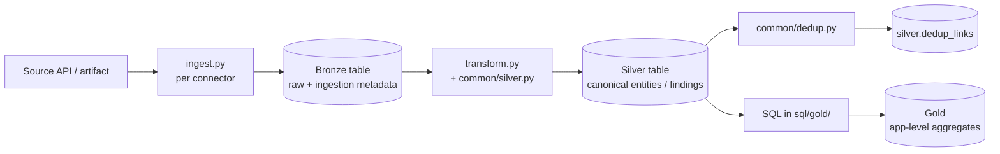

# Platform

The platform is a Databricks-based data integration framework for application security. It ingests from AppSec sources via connectors, normalizes to canonical schemas, and exposes an analytics layer over them.

This surface describes the **implementation-level architecture** of the Databricks reference MVP: module layout, shared libraries, per-connector components, data flow through Bronze / Silver / Gold, and Databricks Asset Bundle (DAB) orchestration.

## Architecture

Medallion layout across three layers:

- **Bronze** — raw landed data, one table per source endpoint, schema-on-read.
- **Silver** — canonical entity and finding tables, severity and status normalized.
- **Gold** — aggregations, evidence views, and dashboards consumed by [Analytics](../analytics/).

All tables live in Unity Catalog under a three-tier namespace (`<catalog>.bronze.*`, `<catalog>.silver.*`, `<catalog>.gold.*`) provisioned by the DAB bootstrap job at [`resources/bootstrap.yml`](https://github.com/vkraus/appsec-mvp/tree/main/resources).

## Top-level layout

Everything product-related lives in the [`appsec-mvp`](https://github.com/vkraus/appsec-mvp) repository:

```text
appsec-mvp/
├── src/
│   ├── common/           # Shared framework library
│   │   ├── bronze.py     # HTTP client, pagination, HWM
│   │   ├── silver.py     # Canonical mapping engine
│   │   ├── severity.py   # Severity normalization
│   │   ├── status.py     # Status normalization
│   │   └── dedup.py      # Cross-tool deduplication
│   └── connectors/
│       ├── servicenow/   # Per-source connector modules
│       ├── github/
│       └── ...
├── config/
│   ├── severity/         # Per-source severity lookup YAML
│   └── status/           # Per-source status lookup YAML
├── resources/            # DAB job bundle fragments (one per source)
├── tests/
│   ├── common/           # Tests for shared framework library
│   └── connectors/       # Tests for per-source connectors
├── sql/                  # Silver and Gold SQL
├── databricks.yml        # DAB root
└── pyproject.toml        # Python package definition
```

## Framework library: `src/common/`

The shared library implements the patterns the connector contract prescribes. Each module is small and focused:

- **[`bronze.py`](https://github.com/vkraus/appsec-mvp/blob/main/src/common/bronze.py)** — ingestion primitives: HTTP client with retry/rate-limit, pagination iterator, high-water-mark arithmetic.
- **[`silver.py`](https://github.com/vkraus/appsec-mvp/blob/main/src/common/silver.py)** — declarative Bronze-to-Silver mapping engine driven by per-connector `mapping.yml`.
- **[`severity.py`](https://github.com/vkraus/appsec-mvp/blob/main/src/common/severity.py)** — loads `config/severity/{source}.yml` and applies the canonical four-level scale with DQ warning on fallthrough.
- **[`status.py`](https://github.com/vkraus/appsec-mvp/blob/main/src/common/status.py)** — loads `config/status/{source}.yml` and applies the canonical five-state lifecycle model.
- **[`dedup.py`](https://github.com/vkraus/appsec-mvp/blob/main/src/common/dedup.py)** — cross-tool deduplication for the Silver Finding table.

Per-connector modules import from `src/common/` and implement only the source-specific bits.

## Per-connector module shape

Each connector at `src/connectors/{source}/` is a self-contained unit:

| File | Purpose |
|---|---|
| `config.yml` | Base URL, endpoints, pagination style, HWM column, target Bronze table, credential reference. |
| `ingest.py` | Implements `ingest(run_id, state) -> batch`. LakeFlow Connect connectors leave this empty; SDK and dlt-based connectors fill it. |
| `transform.py` | Implements `transform(bronze_df) -> silver_df` using the shared mapping engine. |
| `mapping.yml` | Declarative Bronze-to-Silver column expressions. |

Corresponding side-car files:

| File | Purpose |
|---|---|
| `config/severity/{source}.yml` | Native-severity → canonical-severity lookup. |
| `config/status/{source}.yml` | Native-status → canonical-status lookup. |
| `resources/{source}-job.yml` | DAB job bundle fragment (two-task ingest → transform). |
| `tests/connectors/{source}/` | Connector tests with `@pytest.mark.requirement("REQ-...")` markers. |

## Ingestion category decision

Each connector chooses one of three sanctioned ingestion categories in this preference order: Lakeflow Connect, Databricks SDK, then dlt. The per-connector pages under [Connectors](../connectors/) record the chosen category.

## Data flow

Sources land in Bronze through connector pipelines defined in [src/connectors/](https://github.com/vkraus/appsec-mvp/tree/main/src/connectors). Silver transformations apply the canonical mappings documented in [Reference → Canonical mapping](reference/canonical-mapping.md). Gold materializations are defined per the analytics scenarios in [Analytics → Evidence scenarios](../analytics/).



## Orchestration

Each connector ships a DAB job fragment at `resources/{source}-job.yml` declaring a two-task pipeline (ingest → transform). The DAB root [`databricks.yml`](https://github.com/vkraus/appsec-mvp/blob/main/databricks.yml) assembles the fragments into a complete bundle. Deployment: `databricks bundle deploy`.

## Setup path

For reproducing the MVP end-to-end against real accounts — whether as a one-time operator or a third-party reader (examiner, future researcher) rebuilding from the docs alone:

1. [Prerequisites](prerequisites.md) — Databricks workspace, cloud account, terraform.
2. [Terraform apply](terraform-apply.md) — provision the workspace and bundle targets.
3. [Connectors](../connectors/) — wire each source in the recommended order (CMDB first, then SCM, then scanners).
4. [Analytics](../analytics/) — inspect Gold outputs and evidence.

## Reference

- [Canonical mapping](reference/canonical-mapping.md) — Silver schemas consumed by all connectors.
- [REQ catalog](reference/catalog.md) — normative requirement identifiers with traceability.

## Details in code

This Platform surface intentionally stays at the architecture-overview level. For line-level detail, read the code — every module above is linked to its source on GitHub. The Tests surface links from each `REQ-*` to the test file that validates the corresponding module.
