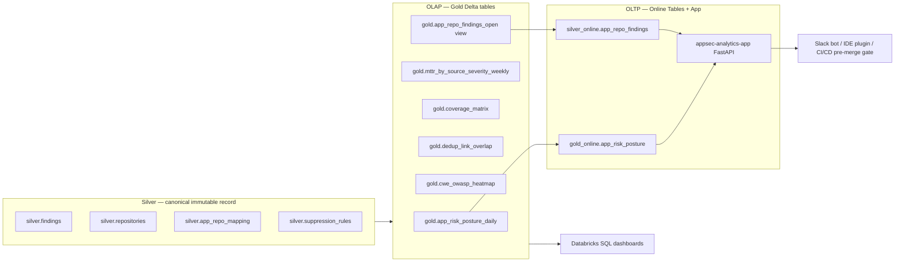

# Build analytics

Phase 3 of the install flow. The analytics layer reads the canonical
Silver tables populated by [Phase 1: Setup platform](../platform/index.md)
and [Phase 2: Install connectors](../connectors/index.md), and produces
two query surfaces: Gold Delta tables for analyst-facing OLAP workloads,
and Online Tables fronted by a Databricks App for tool-facing OLTP
workloads (Slack bots, IDE plugins, CI/CD pre-merge gates).

## Overview

The analytics layer is hand-written. Per the
[skill-scope page](../platform/reference/skill-scope.md), the four
category-aware skills generate the integration layer (per-source
connectors); analytics is bespoke by design because it is the part of
the platform that demonstrates cross-source value (dedup overlap, OWASP
heatmaps, application-level rollups) and is therefore the thesis's
evidence surface. There is one analytics layer per deployment, refreshed
daily.

It produces three artefact families:

- **Five Gold Delta tables** plus one Gold view, materialised under the
  `gold` UC schema. Read by Databricks SQL warehouses, dashboards, and
  notebooks.
- **Two Online Tables** under `gold_online` and `silver_online`,
  Databricks-managed row-store replicas of selected Gold artefacts.
  Sub-50 ms PK lookups via Databricks SQL serverless.
- **One Databricks App** (`appsec-analytics-app`), a small FastAPI
  service that reads the Online Tables and serves two endpoints — a
  security score lookup and a CI/CD pre-merge gate.

A separate analytics-layer table, `silver.suppression_rules`, lives in
the Silver UC schema (because it is operator-authored data the Gold
notebooks read). It is documented in the
[Suppression rules](suppression-rules.md) page.

## Layered architecture

The OLAP and OLTP query paths share Silver as the source of truth and
diverge from there. Gold sits on the OLAP side; Online Tables and the
App sit on the OLTP side.



The boundary is intentional. OLAP queries are wide aggregations that
scan many rows; the cost model of Delta + photon-vectorised scans is the
right tool. OLTP queries are point lookups by primary key; the cost
model of a row-store replica with single-digit-millisecond response is
the right tool. Both consume the same Silver record, so both reflect
the same canonical truth.

## What is in this section

- [Gold datasets](gold-datasets.md) — one section per Gold table and
  view: question answered, schema, refresh cadence, source Silver
  tables, suppression behaviour, example SQL.
- [Online tables](online-tables.md) — the two Online Tables, their
  refresh mode, query patterns, deployment runbook, and the failure-mode
  fallback for workspaces where Online Tables are not available.
- [Databricks app](databricks-app.md) — endpoint contracts, policy
  configuration, deployment runbook, observability, and authentication
  posture for the FastAPI service that serves the score lookup and the
  pre-merge gate.
- [Suppression rules](suppression-rules.md) — the
  `silver.suppression_rules` schema, rule semantics, the operator
  workflow via the admin notebook, and worked examples.
- [Dashboards](dashboards.md) — a Databricks SQL dashboard wired
  against the Gold tables. Widget queries, what each one shows, and the
  import procedure.
- [Evidence scenarios](evidence.md) — three end-to-end scenarios that
  exercise the cross-source pipeline against Silver directly. Useful as
  a smoke test before relying on Gold rollups.
- [Tests and traceability](tests.md) — pytest patterns for analytics:
  synthetic DataFrame fixtures, mocked-SQL App tests, and the live-test
  marker convention.

## Refresh cadence

| Surface | Cadence | Mechanism |
|---|---|---|
| Gold Delta tables (5 tables + 1 view) | Daily, 05:00 UTC | `analytics` job (`src/analytics/resources/job.yml`) — six parallel notebook tasks on a shared cluster |
| `gold_online.app_risk_posture` Online Table | Continuous (~5-min lag) | Databricks-managed sync from `gold.app_risk_posture_daily` |
| `silver_online.app_repo_findings` Online Table | Continuous (~5-min lag) | Databricks-managed sync from the `gold.app_repo_findings_open` view |
| `appsec-analytics-app` (FastAPI) | Always-on | Single-replica Databricks App; queries Online Tables on each request |

Daily cadence for Gold is deliberate: the upstream connector ingests are
hourly to daily, so a 05:00 UTC refresh leaves the EU business day with
overnight-fresh data. The Online Tables sit downstream of Gold, so their
~5-min lag is measured from when the daily Gold refresh completes — for
the score endpoint this is the right behaviour (severity counts do not
need sub-minute freshness). The pre-merge gate's underlying view
(`gold.app_repo_findings_open`) is also refreshed daily; the lower bound
on freshness for blocking PRs is the cadence of the contributing Silver
ingests, not the Gold view.

## Where to start

If you are operating the analytics layer for the first time:

1. Confirm Silver is populated. Run the
   [Evidence scenarios](evidence.md) — all three should return non-zero
   rows.
2. Trigger the analytics job once on demand:
   ```bash
   databricks bundle run analytics --target dev
   ```
   This populates all six Gold artefacts. After it succeeds, the daily
   schedule keeps them fresh.
3. Verify the Online Tables provisioned: open the Databricks Catalog
   Explorer and check that `gold_online.app_risk_posture` and
   `silver_online.app_repo_findings` show the "Online" badge with a
   recent sync time.
4. Smoke-test the App:
   ```bash
   databricks apps run appsec-analytics-app
   ```
   See the [Databricks app](databricks-app.md) page for the request and
   response shapes.
