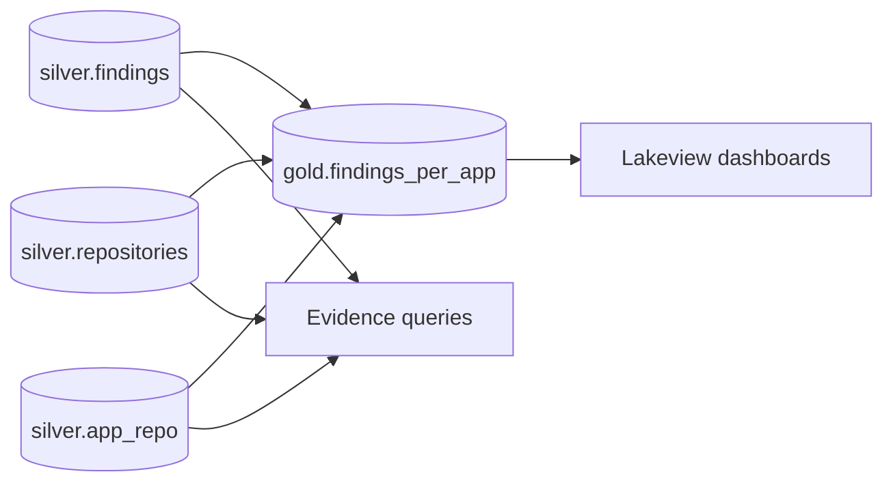

# Build analytics

Phase 3 of the install flow. Analytics consumes the canonical Silver
tables populated by [Phase 1: Setup platform](../platform/index.md) and
[Phase 2: Install connectors](../connectors/index.md), and produces the
gold-layer aggregates and evidence views used by reporting and
dashboards.

!!! info "Scaffolding only at the redesign stage"
    The analytics layer is intentionally light in the Databricks-centric
    redesign. The DAB deploys a `gold` schema and a placeholder analytics
    job (`src/analytics/resources/job.yml`) so the include glob picks up
    future fragments automatically, but the full analytics implementation
    — gold tables, scheduled refresh, dashboard bundles — is tracked as
    follow-on work.

    Until that lands, the [Evidence scenarios](evidence.md) page documents
    queries that read directly from `silver.findings`, `silver.app_repo`,
    and `silver.repositories` — operators can run those queries by hand
    in a SQL editor against the warehouse to validate the end-to-end
    pipeline.

## Computation model



The gold layer aggregates Silver into per-application, per-team, and
per-finding-shape views. Each gold table has a single owner (the
analytics layer) and is refreshed by the analytics job on a schedule.

## Pages

- [Gold datasets](gold-datasets.md) — canonical Gold tables and views with
  column documentation. Forthcoming.
- [Evidence scenarios](evidence.md) — three end-to-end scenarios with the
  queries that produce them. The scenarios validate the cross-source
  pipeline (SCM → CMDB → SAST → DAST) end-to-end without requiring the
  full analytics implementation.
- [Dashboards](dashboards.md) — Lakeview dashboards that visualize gold
  outputs. Forthcoming.
- [Tests and traceability](tests.md) — REQ-* to pytest traceability index.

## How dashboards will be served

Lakeview dashboards in Databricks read directly from gold tables; once the
analytics job is implemented, dashboard JSON bundles will live under
`src/analytics/resources/` alongside the schema and job fragments and be
deployed by `databricks bundle deploy` like every other DAB resource.

## Data dependencies for analytics

Analytics queries assume the SCM-first install order has been respected:

- `silver.repositories` populated by an SCM connector
  ([GitHub](../connectors/scm/github.md) or [GitLab](../connectors/scm/gitlab.md)).
- `silver.app_repo` populated by the [ServiceNow connector](../connectors/cmdb/servicenow.md).
- `silver.findings` populated by at least one scanner connector
  ([SonarQube](../connectors/sast/sonarqube.md), [Semgrep](../connectors/sast/semgrep.md),
  [OWASP ZAP](../connectors/dast/owasp-zap.md)).

If any of these tables are empty, the corresponding rollup row is empty.
The [Evidence scenarios](evidence.md) page calls this out per scenario.

## Run the placeholder analytics job

The bundle deploys a placeholder job that points at
`src/analytics/sql/gold_findings_summary_placeholder.sql`. It runs only
on demand:

```bash
databricks bundle run analytics --target dev
```

The job will fail until the placeholder SQL is replaced with real gold
DDL — that replacement is part of the analytics follow-on. Operators do
not need to run this job during Phase 1+2 setup.
