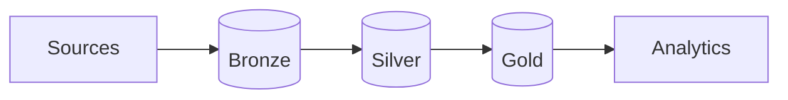

---
hide:
  - toc
---

Application Security · Databricks Reference MVP

# Unify AppSec findings across CMDB, SCM, SAST, SCA, Secrets, DAST, and WAF.

An MVP implementation of a data integration framework for application security, built on Databricks.

[Start setup →](platform/index.md){ .md-button .md-button--primary }
[View on GitHub](https://github.com/vkraus/appsec-mvp){ .md-button }

The platform ingests from AppSec sources via per-source connectors, normalizes findings to canonical schemas, and exposes analytics over them. The reference implementation runs on Databricks and is packaged as an Asset Bundle.

## Install order

-   :material-server-network:{ .lg .middle } **1. [Setup platform](platform/index.md)**

    ---

    Workspace bootstrap: catalog, schemas, jobs, secrets.

-   :material-power-plug:{ .lg .middle } **2. [Install connectors](connectors/index.md)**

    ---

    Wire each AppSec source.

-   :material-chart-line:{ .lg .middle } **3. [Build analytics](analytics/index.md)**

    ---

    Gold datasets, evidence scenarios, dashboards.

### Connector categories

-   :material-source-branch:{ .lg .middle } **1. [SCM](connectors/scm/index.md)**

    ---

    GitHub, GitLab. Must be installed first; populates `silver.repositories`.

-   :material-database:{ .lg .middle } **2. [CMDB](connectors/cmdb/index.md)**

    ---

    ServiceNow.

-   :material-magnify-scan:{ .lg .middle } **3. [SAST](connectors/sast/index.md)**

    ---

    SonarQube, Semgrep.

-   :material-package-variant:{ .lg .middle } **4. [SCA](connectors/sca/index.md)**

    ---

    Dependency-Track.

-   :material-key-variant:{ .lg .middle } **5. [Secrets](connectors/secrets/index.md)**

    ---

    TruffleHog.

-   :material-bug-check:{ .lg .middle } **6. [DAST](connectors/dast/index.md)**

    ---

    OWASP ZAP.

-   :material-shield-check:{ .lg .middle } **7. [WAF](connectors/waf/index.md)**

    ---

    AWS WAF.

