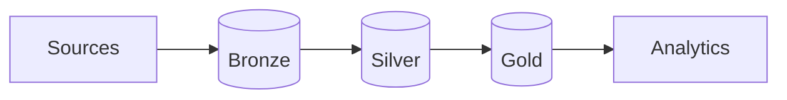

---
hide:
  - toc
---

Application Security · Databricks Reference MVP

# Unify AppSec findings across CMDB, SCM, SAST, SCA, Secrets, DAST, and WAF.

An MVP implementation of a data integration framework for application security, built on Databricks.

[Start setup →](platform/prerequisites.md){ .md-button .md-button--primary }
[View on GitHub](https://github.com/vkraus/appsec-mvp){ .md-button }

The platform ingests from AppSec sources via per-source connectors, normalizes findings to canonical schemas, and exposes analytics over them. The reference implementation runs on Databricks and is packaged as an Asset Bundle.

## Install order

-   :material-clipboard-check:{ .lg .middle } **1. [Prerequisites](platform/prerequisites.md)**

    ---

    Databricks workspace, cloud account, Terraform, credentials.

-   :material-server-network:{ .lg .middle } **2. [Terraform apply](platform/terraform-apply.md)**

    ---

    Provision workspace, UC metastore, secret scopes, bundle targets.

-   :material-power-plug:{ .lg .middle } **3. [Connectors](connectors/index.md)**

    ---

    Wire each AppSec source, in the order below.

    

    -   **CMDB** — [ServiceNow](connectors/cmdb/index.md)
    -   **SCM** — [GitHub, GitLab](connectors/scm/index.md)
    -   **SAST** — [SonarQube, Semgrep](connectors/sast/index.md)
    -   **SCA** — [Dependency-Track](connectors/sca/index.md)
    -   **Secrets** — [TruffleHog](connectors/secrets/index.md)
    -   **DAST** — [OWASP ZAP](connectors/dast/index.md)
    -   **WAF** — [AWS WAF](connectors/waf/index.md)

    

-   :material-chart-line:{ .lg .middle } **4. [Analytics](analytics/index.md)**

    ---

    Gold datasets, evidence scenarios, dashboards.

