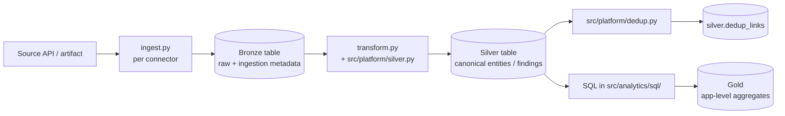

# Setup platform

Phase 1 of the install flow. The platform layer is the Databricks-resident
substrate that every connector lands data into and every analytics
computation reads from. This section documents the four operator steps
needed to stand it up.

!!! note "Platform name disambiguation"
    The word *platform* is used in two senses in this repository.
    1. **Setup phase for operators** (this section): the workspace
       bootstrap that produces the catalog, schemas, jobs, and
       secret scope container deployed by DAB before any connector is installed.
    2. **`src/platform/` Python framework**: the shared library
       (HTTP client, pagination, severity and status normalization, dedup) that
       every connector imports. See
       [Project layout](reference/project-layout.md) for the module layout.
    Both senses appear throughout the docs. Context disambiguates which is
    meant.

## Phase 1: four steps

The redesigned platform is stood up in four sequential steps. Each page is
self-sustained: an operator can finish the step from that page alone.

-   :material-clipboard-check:{ .lg .middle } **1. [Prerequisites](prerequisites.md)**

    ---

    Inputs supplied by the operator: AWS backbone (VPC, EKS, S3, IAM), Databricks
    workspace plus UC metastore, local CLI tooling, env var conventions.

-   :material-package-down:{ .lg .middle } **2. [Bundle deploy](bundle-deploy.md)**

    ---

    `databricks bundle deploy --target dev`. Creates the catalog, schemas,
    jobs, pipelines, volumes, and the ServiceNow connection.

-   :material-key-chain:{ .lg .middle } **3. [Secrets bootstrap](secrets-bootstrap.md)**

    ---

    Run `src/platform/scripts/bootstrap.sh` to create the secret scope,
    storage credential, and external location. Secret loaders for each connector
    populate values when each connector is wired.

-   :material-database-cog:{ .lg .middle } **4. [Platform bootstrap job](platform-bootstrap-job.md)**

    ---

    `databricks bundle run platform-bootstrap`. Applies the silver table
    DDL via the SQL warehouse for the platform.

After all four steps land, Phase 1 is complete and the platform is ready to
install connectors. Move on to [Install connectors](../connectors/index.md).
Start with the [SCM category](../connectors/scm/index.md) because SCM
connectors populate `silver.repositories`, which findings from every other connector
reference.

## Architecture context

The platform implements a medallion layout across three layers:

- **Bronze**: raw landed data, one schema per source (`bronze_<source>`),
  schema on read.
- **Silver**: standard entity and finding tables, severity and status
  normalized. Cross-source tables live in the `silver` schema. Projections
  for each source live in `silver_<source>` schemas.
- **Gold**: aggregations, evidence views, and dashboards consumed by
  [Analytics](../analytics/index.md).

All tables live in Unity Catalog under a three-tier namespace
(`<catalog>.bronze_<source>.*`, `<catalog>.silver.*`,
`<catalog>.silver_<source>.*`, `<catalog>.gold.*`). The `<catalog>` token
varies by environment: `appsec_dev`, `appsec_staging`, `appsec_prod`.

## Reference

- [Project layout](reference/project-layout.md): top-level directory
  structure and module structure for each component.
- [Recommended mapping](reference/canonical-mapping.md): Silver schemas
  consumed by all connectors.
- [REQ catalog](reference/catalog.md): normative requirement identifiers
  with traceability matrix.
- [Connector skills](reference/connector-skills.md): the three skills
  (`analyze-source`, `generate-connector`, `validate-implementation`) that
  drive the connector lifecycle.
- [Source capability matrix](reference/source-capability-matrix.md):
  protocol, pagination, HWM, and severity for each source.
- [Source characteristics](reference/source-characteristics.md):
  protocol decision context for each source.
- [Connector job template](reference/connector-job-template.md): DAB
  fragment structure every connector follows.
- [Silver table ownership](reference/silver-table-ownership.md): which
  connector populates which Silver table.
- [Single `silver.findings` rationale](reference/single-silver-findings-rationale.md):
  design decision for the cross-source findings table.
